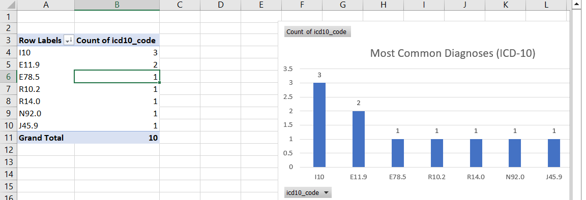
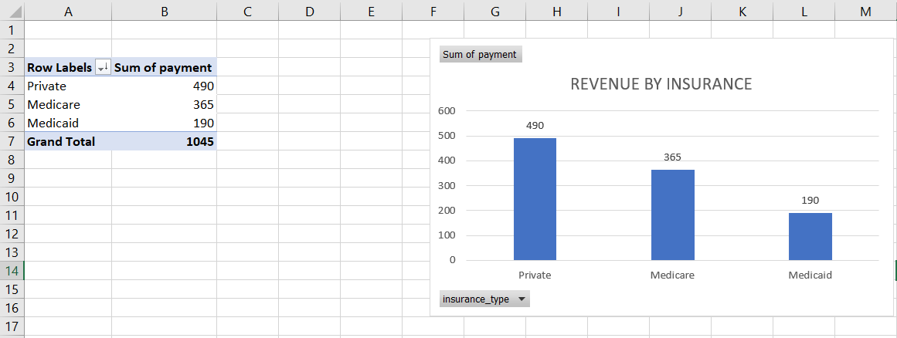
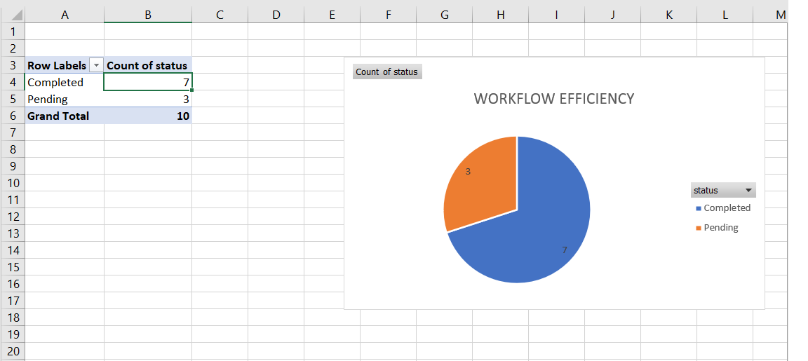

# 📊 Healthcare Data Analysis Project

## 🔍 Overview
This project analyzes healthcare encounter data using ICD-10 diagnosis codes, CPT procedure codes, and insurance/payment data to generate insights into clinical trends, revenue, and workflow efficiency.

---

## 🧠 Key Insights

### 1. Most Common Diagnoses
- Hypertension (I10) was the most frequent condition

---

### 2. Revenue by Insurance
- Private insurance generated the highest revenue
- Medicaid generated the lowest revenue

---

### 3. Workflow Efficiency
- 70% of encounters were completed
- 30% were pending

---

## 🛠 Tools Used
- Microsoft Excel
- Pivot Tables
- Data Visualization

---

## 🔐 Data Security
- Dataset is de-identified (no personal patient information)
- Demonstrates understanding of healthcare data privacy principles
